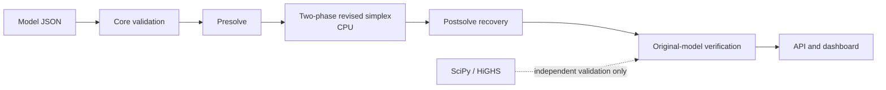

# Nirnaya

**WHAT** — Nirnaya is an inspectable continuous linear optimization platform for validated, explainable industrial decisions. It models production, blending, allocation, and routing under linear constraints. Its refinery showcase is MRPL-inspired synthetic data; it contains no MRPL or live plant operating data.

**HOW** — The production path validates a sparse LP, applies reversible presolve, solves with Nirnaya's repository-authored two-phase revised simplex on CPU, recovers the original variables, and verifies the original model.



**DEMO** — From the repository root run `python scripts/launch_demo.py`. This starts the API and configured UI together. The UI shows API OFFLINE and the same launch instruction if it cannot connect.

**EVIDENCE** — The reproducible in-process benchmark matrix, live HTTP release validation, independent validation suite, and synthetic scenario suite are separate artifacts. Their latest recorded counts and limitations are in [validation evidence](docs/VALIDATION.md); prior failures remain archived.

The NOC-10K suite is a **10,000-instance optimization validation corpus**, not ML training. Its deterministic model generator, reference-label pipeline, held-out split, and run status are documented in [NOC-10K evaluation](docs/NOC10K.md).

**LIMITATIONS** — LP simplex runs on CPU only. The sparse solver uses bounded product-form eta basis updates with periodic residual checks and refactorization; concurrent heavy API requests have no admission control. GPU simplex, integer/nonlinear optimization, dual certificates, and operational plant data are not implemented. Browser verification status is recorded in `docs/VALIDATION.md`.

Nirnaya is an inspectable continuous linear optimization stack: sparse model contracts, reversible presolve, a repository-authored two-phase revised-simplex CPU solver, an API, and a decision-focused UI. The bundled industrial-style cases are synthetic illustrations; they are not operational plant data or recommendations.

## What is implemented

- `nirnaya-core`: validated LP models, sparse problem data, numerical configuration, and stable result contracts.
- `nirnaya-presolve`: structural reductions and postsolve recovery.
- `nirnaya-solver`: deterministic two-phase revised simplex with a sparse LU base, bounded product-form eta basis updates, periodic refactorization/residual checks, original-model verification, and explicit infeasible, unbounded, numerical-error, iteration-limit, and time-limit statuses.
- `nirnaya-gpu`: device discovery and numerical primitives. Nirnaya has a GPU-ready architecture with a GPU primitive/capability layer; the current production LP solver executes on CPU.
- `nirnaya-api`: JSON/CLI/REST orchestration through core, presolve, solver, and postsolve.
- `apps/nirnaya-ui`: local static dashboard for model review, solving, scenario comparison, verification, benchmark evidence, architecture, and security boundaries.

The solver retains deterministic Bland ordering and original-model verification. Its sparse basis update chain is bounded and periodically checked against configured primal/dual residual tolerances; sparse LU refactorization resets the chain. Dual certificates, integer solving, and operational data are not implemented. See [algorithm](docs/SOLVER_ALGORITHM.md) and [known limitations](docs/NUMERICAL_RELIABILITY.md).

## Install

From the repository root, install runtime and test dependencies and the five local packages:

```powershell
python -m pip install -r requirements.txt
```

`requirements.txt` installs the five local packages and test runner/client needed by `python -m pytest -q`. `requirements-dev.txt` remains a compatibility alias to this complete environment. SciPy provides sparse numerical kernels and independent validation; the production path does not call `scipy.optimize.linprog`. CUDA/CuPy is optional and does not enable GPU simplex.

## System requirements

- Windows 10/11 (the scripts also support Python environments on other platforms)
- Python 3.10 or later and a browser
- Network access during first installation if the required Python wheels are not already cached; the demo itself downloads no data or binaries
- CUDA/CuPy is optional; the current LP solver runs on CPU

## Run the tests and validations

```powershell
python -m pytest -q
python scripts/run_release_validation.py --base-url http://127.0.0.1:8000
python apps/nirnaya-ui/validation/run_validation_suite.py --base-url http://127.0.0.1:8000 --backends cpu
python benchmarks/run_benchmark_matrix.py --time-limit 30
python benchmarks/run_scenarios.py
```

Start the demo first for API-backed E2E and release tests. Offline API-dependent checks skip explicitly; those skips are not passes. Corpus tooling is documented in [docs/NOC10K.md](docs/NOC10K.md).

## Project structure

- `packages/`: core contracts, presolve/postsolve, CPU solver, GPU primitives, and REST API
- `apps/nirnaya-ui/src/`: self-contained static dashboard assets
- `scripts/`: canonical launcher, release validation, and NOC-10K tools
- `datasets/` and `benchmarks/`: synthetic LP inputs, deterministic corpus manifest, regression records, and selected evidence
- `examples/`: generated refinery-style synthetic flagship
- `docs/` and `tests/`: run guides, limits, and automated tests

## Troubleshooting

- If the dashboard says **API OFFLINE**, start it with `python scripts/launch_demo.py`; check the API URL shown in the page and use the printed UI address.
- If installation reports missing build requirements, retry with network access or a populated pip wheel cache; no dependency is downloaded when launching the demo.
- If GPU is unavailable, use the CPU backend. CUDA is optional and GPU simplex is not implemented.
- If API-dependent pytest cases skip, set `NIRNAYA_API_URL` to the running API and rerun the suite.

## SIH judge demo flow

Follow the timed [judge demo path](docs/DEMO.md): synthetic refinery decision ? optimize ? inspect solution ? presolve/original-model verification ? scenarios ? independent validation ? architecture/security/GPU limits.

## One-command demo

```powershell
python scripts/launch_demo.py
```

This generates the local synthetic refinery case, starts the production API and static UI, and opens the dashboard. Use `--no-browser` for a headless launch, or `--api-port 8001 --ui-port 8081` to choose ports. The three-minute script is [docs/DEMO.md](docs/DEMO.md); the flagship assumptions are in [docs/DATASETS.md](docs/DATASETS.md) and the model metadata.

## Python and API

```python
from nirnaya_api import Model

m = Model("production")
m.add_variable("standard", lb=0, ub=10)
m.add_variable("premium", lb=0, ub=10)
m.add_constraint("capacity", {"standard": 1, "premium": 1}, "<=", 8)
m.set_objective({"standard": 3, "premium": 5}, sense="max")
result = m.solve()
print(result.to_dict())
```

For advanced separate-process development, configure the exact dashboard origin in the API terminal before starting Uvicorn; otherwise browser requests from the UI are rejected by the API's default empty CORS allowlist. The one-command launcher does this automatically.

```powershell
$env:NIRNAYA_CORS_ORIGINS='http://127.0.0.1:8080'
python -m uvicorn nirnaya_api.server:app --host 127.0.0.1 --port 8000
# In a second terminal:
python -m http.server 8080 --directory apps/nirnaya-ui/src
```

## Release handoff

The frozen scope, measured status, limitations, and checklist are in [release manifest](docs/RELEASE_MANIFEST.md) and [release checklist](docs/RELEASE_CHECKLIST.md). The solver uses bounded sparse basis updates; the exact sparse model and deterministic NOC-10K evaluation results, including archived earlier timeouts, are documented in [NOC-10K](docs/NOC10K.md).

## Reproducible evidence

Dataset provenance and the license review policy are in [docs/DATASETS.md](docs/DATASETS.md); exact benchmark method and commands are in [docs/BENCHMARKS.md](docs/BENCHMARKS.md). The machine-readable [dataset manifest](benchmarks/manifest.json), read-only [preparation audit](benchmarks/datasets/preparation_audit.json), production-path [benchmark results](benchmarks/results/reproducible/latest.json), [scenario results](benchmarks/results/refinery-scenarios/latest.json), and [sparse-model record](benchmarks/results/sparse-large-lp-production.json) preserve evidence, including non-optimal statuses and unavailable measurements.

The production solve and SciPy/HiGHS reference solve use the same input independently. Reports check status, objective, and original-model feasibility; coordinate-wise primal comparisons are diagnostics because an LP can have multiple optimal solutions. No reference optimizer is used as a production fallback.

## Test and validation commands

Pytest uses the ignored, repository-local `.pytest-tmp` directory for temporary fixtures. Set the source paths below if the packages have not been installed.

### Mode A: unit/core tests without a live API

API-dependent E2E tests **skip** when the API is offline; those skips are not passes. In the verified offline run, 12 API checks skipped and 8 CUDA/GPU checks skipped. Core and other API-independent tests still ran.

#### PowerShell

```powershell
$env:PYTHONPATH='packages/nirnaya-core/src;packages/nirnaya-presolve/src;packages/nirnaya-gpu/src;packages/nirnaya-solver/src;packages/nirnaya-api/src'
Remove-Item Env:NIRNAYA_API_URL -ErrorAction SilentlyContinue
python -m pytest -q
```

#### Command Prompt (CMD)

```bat
set PYTHONPATH=packages/nirnaya-core/src;packages/nirnaya-presolve/src;packages/nirnaya-gpu/src;packages/nirnaya-solver/src;packages/nirnaya-api/src
set NIRNAYA_API_URL=
python -m pytest -q
```

### Mode B: full live E2E

Start the canonical demo in Terminal 1:

```text
python scripts/launch_demo.py
```

Terminal 2, PowerShell:

```powershell
$env:PYTHONPATH='packages/nirnaya-core/src;packages/nirnaya-presolve/src;packages/nirnaya-gpu/src;packages/nirnaya-solver/src;packages/nirnaya-api/src'
$env:NIRNAYA_API_URL='http://127.0.0.1:8000'
python -m pytest apps/nirnaya-ui/tests/e2e tests/ui/e2e -q
```

Terminal 2, Command Prompt (CMD):

```bat
set PYTHONPATH=packages/nirnaya-core/src;packages/nirnaya-presolve/src;packages/nirnaya-gpu/src;packages/nirnaya-solver/src;packages/nirnaya-api/src
set NIRNAYA_API_URL=http://127.0.0.1:8000
python -m pytest apps/nirnaya-ui/tests/e2e tests/ui/e2e -q
```

The live E2E result was 12 passed; if the API is stopped, these tests skip instead. The legacy standalone presolve test directory is not part of the root release suite because it targets an older `nirnaya_core.Sense` API. The integrated presolve path is covered by the current suite.

Do not paste Markdown headings or lines beginning with `#` into CMD; they are explanatory comments, not commands.

### Reference validation and benchmark commands

```text
python scripts/run_release_validation.py --base-url http://127.0.0.1:8000
python apps/nirnaya-ui/validation/run_validation_suite.py --base-url http://127.0.0.1:8000 --backends cpu
python benchmarks/run_benchmark_matrix.py --time-limit 30
python benchmarks/run_synthetic_suite.py
python benchmarks/run_scenarios.py
```

See [docs/JUDGE_GUIDE.md](docs/JUDGE_GUIDE.md), [architecture](docs/ARCHITECTURE.md), [numerical reliability](docs/NUMERICAL_RELIABILITY.md), and [security boundaries](docs/SECURITY.md) for a concise review path. Validation limitations and current measured results are in [docs/VALIDATION.md](docs/VALIDATION.md).

## Licensing

The original core package declares Apache-2.0 and the GPU package declares MIT; API metadata declares Apache-2.0. The supplied presolve and UI archives have no explicit license declaration. Synthetic inputs authored in this project are marked as having no separate license file; do not infer a redistribution license from authorship. External candidate datasets are not bundled pending instance-specific review. Original source archives remain retained in `source-archives/`.
