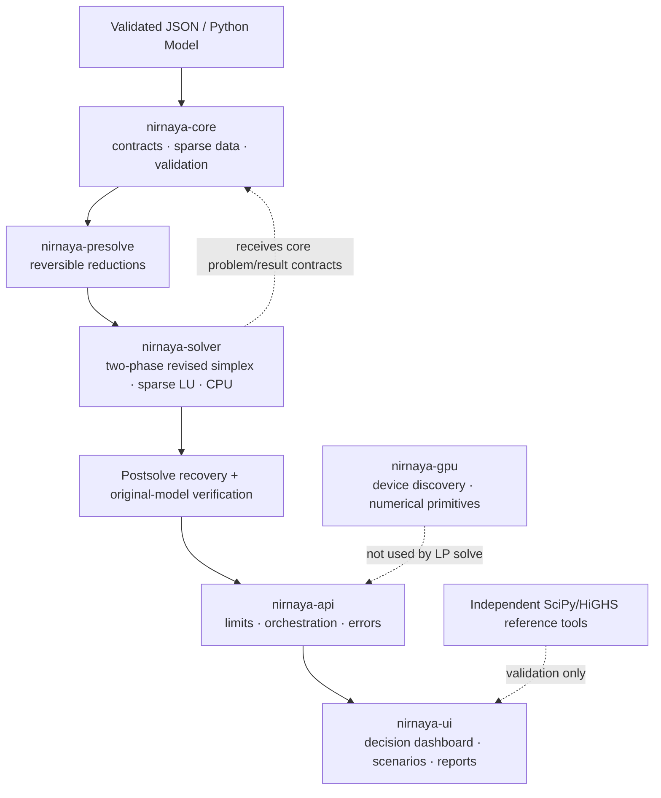

# Architecture

## Data flow

1. API schema validation converts the named JSON model into core's `Model`, then immutable `ProblemData` with sparse equality/inequality matrices, bounds, objective, and numerical configuration.
2. Optional presolve returns a reduced core model plus reversible reconstruction state, trace/statistics, and actual reduced dimensions/nonzeros.
3. The solver applies variable transformations and inequality slacks, runs Phase I, removes zero-valued artificial basics or redundant rows, then runs Phase II with CPU sparse LU and deterministic pricing/ratio rules.
4. Solver checks reduced costs and the original-space primal. Presolve postsolve restores eliminated values; the API independently checks original constraints and bounds before returning `optimal`.
5. UI scenario runs change listed assumptions and submit each resulting model to the same production API. Validation reports and benchmarks call separate SciPy/HiGHS tooling; production imports neither.

## Package boundaries

- `nirnaya-core` is the data contract and has no dependency on API/UI.
- `nirnaya-presolve` and `nirnaya-solver` depend on core; solver does not import API.
- `nirnaya-gpu` owns device discovery and primitive kernels; it does not select/replace the LP algorithm.
- `nirnaya-api` adapts inputs, enforces service limits, and calls the production packages.
- `apps/nirnaya-ui` makes HTTP requests to API; it does not solve models.
- `reference_solver.py` lives in validation tooling and is not imported by production packages.

The dependency direction avoids cycles. The top-level `packages/` remain separately installable distributions in one workspace, rather than claims of six independently deployed repositories.
